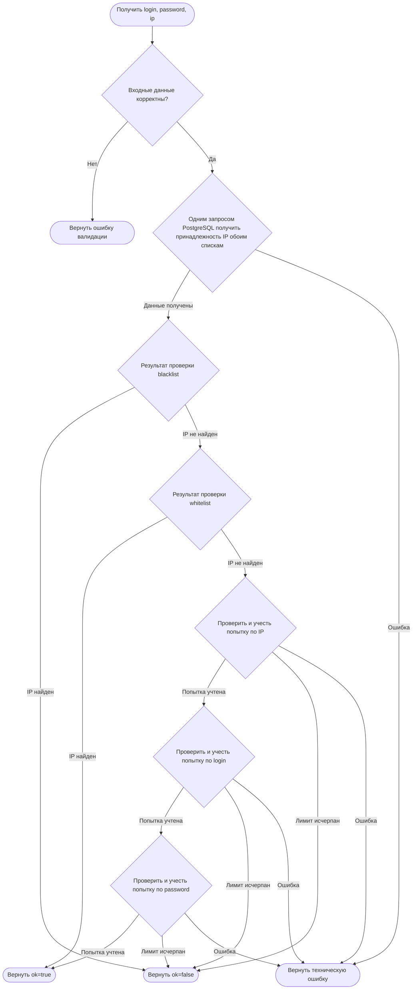

# Проверка попытки авторизации

```mermaid
flowchart TD
    START(["Получить login, password, ip"])
    VALID{"Входные данные корректны?"}
    INVALID(["Вернуть ошибку валидации"])
    LISTS{"Одним запросом PostgreSQL получить принадлежность IP обоим спискам"}
    BLACK{"Результат проверки blacklist"}
    WHITE{"Результат проверки whitelist"}
    IP{"Проверить и учесть попытку по IP"}
    LOGIN{"Проверить и учесть попытку по login"}
    PASSWORD{"Проверить и учесть попытку по password"}
    ALLOW(["Вернуть ok=true"])
    DENY(["Вернуть ok=false"])
    ERROR(["Вернуть техническую ошибку"])

    START --> VALID
    VALID -->|"Нет"| INVALID
    VALID -->|"Да"| LISTS
    LISTS -->|"Данные получены"| BLACK
    LISTS -->|"Ошибка"| ERROR
    BLACK -->|"IP найден"| DENY
    BLACK -->|"IP не найден"| WHITE
    WHITE -->|"IP найден"| ALLOW
    WHITE -->|"IP не найден"| IP
    IP -->|"Попытка учтена"| LOGIN
    IP -->|"Лимит исчерпан"| DENY
    IP -->|"Ошибка"| ERROR
    LOGIN -->|"Попытка учтена"| PASSWORD
    LOGIN -->|"Лимит исчерпан"| DENY
    LOGIN -->|"Ошибка"| ERROR
    PASSWORD -->|"Попытка учтена"| ALLOW
    PASSWORD -->|"Лимит исчерпан"| DENY
    PASSWORD -->|"Ошибка"| ERROR
```

При отказе или ошибке сохранять списания и обновлённый TTL предыдущих этапов.
